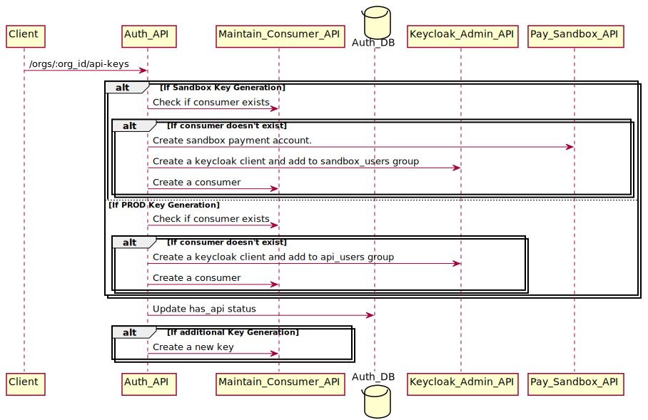

# API Gateway Key Creation

Document explains how a new API gateway key for an account is created.


### Target Audience
Developers and operational support members.
## Sandbox Setup
Sandbox uses Auth and Keycloak from PROD, and Pay, ppr etc. from Sandbox environment.

### Sequence of Integration key generation
<!--
```
@startuml api_gw/account_key

participant Client
participant Auth_API
participant Maintain_Consumer_API
database    Auth_DB
participant Keycloak_Admin_API
participant Pay_Sandbox_API

Client -> Auth_API: /orgs/:org_id/api-keys
alt If Sandbox Key Generation
    Auth_API -> Maintain_Consumer_API:  Check if consumer exists
    alt If consumer doesn't exist
        Auth_API -> Pay_Sandbox_API : Create sandbox payment account.
        Auth_API -> Keycloak_Admin_API : Create a keycloak client and add to sandbox_users group
        Auth_API -> Maintain_Consumer_API: Create a consumer
    end
else If PROD Key Generation
    Auth_API -> Maintain_Consumer_API:  Check if consumer exists
    alt If consumer doesn't exist
        Auth_API -> Keycloak_Admin_API : Create a keycloak client and add to api_users group
        Auth_API -> Maintain_Consumer_API: Create a consumer
    end
end
Auth_API -> Auth_DB : Update has_api status
alt If additional Key Generation
    Auth_API -> Maintain_Consumer_API:  Create a new key
end
@enduml
```
-->
 

