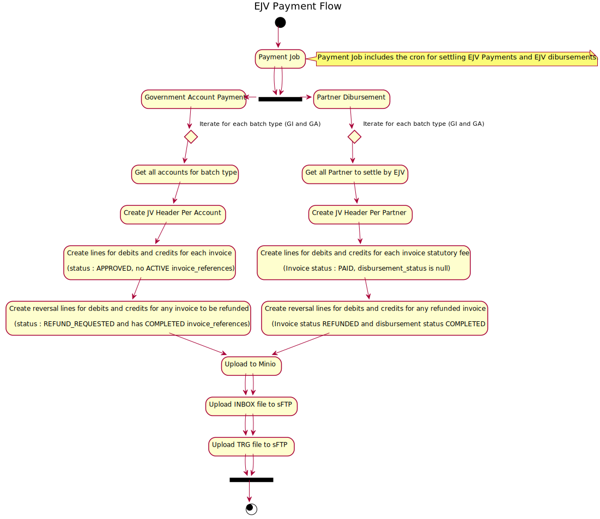
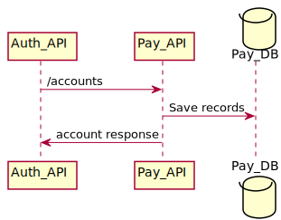
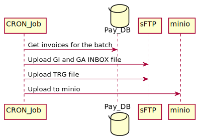
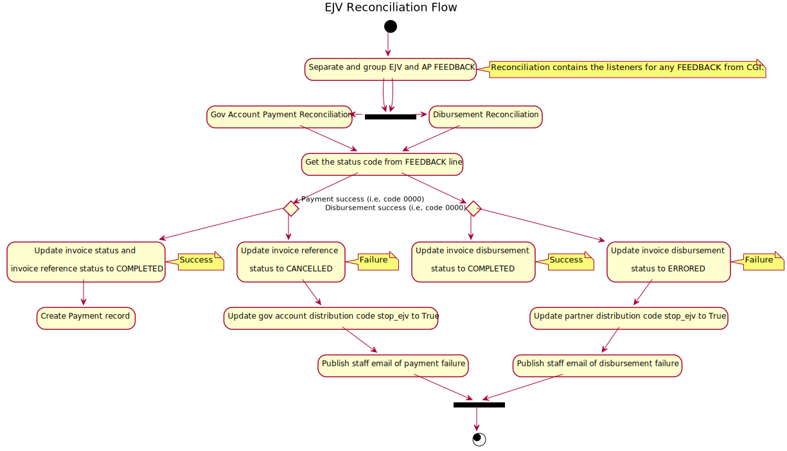
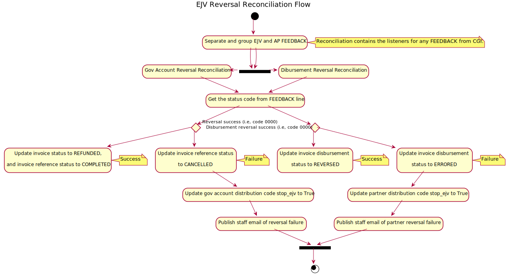
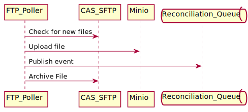
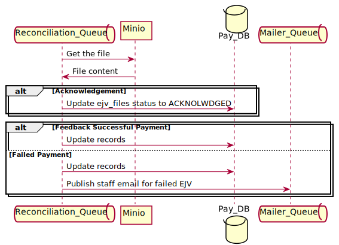
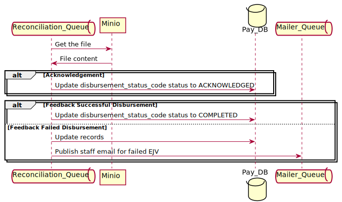

# Electronic Journal Voucher (EJV)

Document explains how a Electronic Journal Voucher is handled from a technical integration point of view.
EJV is a method of payment to transfer funds between revenue accounts in CAS using GL codes. We use CGI (CAS Generic Interface) to do this.

EJV is used for below purposes:
- Government account (GOVM) payments where they pay using EJV with GL codes. PS : Service BC account is an exception in this case. They push the payments to BC Registries GL using GARMs. This is controlled by a `billable=false` flag in payment_accounts table. No EJV CGI process is initiated if `billable=false`.
- Revenue Disbursements for the disbursing revenue to Partner government ministries (e.g, Wills Registry, CSO, RPT etc.) 

## Overall Process



### Target Audience
Developers and operational support members.

# EJV as Payment Methd (Government accounts)
## Setting Up a EJV account
Setting up a EJV account creates the GL code entries on Pay database and no external integration is done at this point of time.

#### Create account flow
When an account creation request for EJV is received, Pay-API populates the below tables in database,
- payment_accounts
- distribution_codes - saves the GL information with `payment_accounts.id`.


<!--
```
@startuml ejv/create_ejv_account
participant Auth_API
participant Pay_API
database    Pay_DB

Auth_API -> Pay_API: /accounts
Pay_API -> Pay_DB : Save records
Pay_API -> Auth_API: account response

@enduml
```
-->



## Payment Request
When an account with EJV as the payment method initiates a payment request, Pay-API returns a success message with status code `APPROVED`.


<!--
```
@startuml ejv/payment_request
actor       Client
participant Pay_API
database    Pay_DB
queue       Pay_Queue

Client -> Pay_API: /payment-requests
Pay_API -> Pay_DB : Save records
Pay_API -> Pay_Queue : Publish event
Pay_API -> Client: payment request response

@enduml
```
-->


###### Tables updated
- invoices - payment_method_code as **EJV**, invoice_status_code as **APPROVED**
- payment_line_items - a line created for each filing type in the request.


## EJV Payment Job
For a government account payment, `credit` is always to BC Registries GL code, i.e, the distribution code configured against each fee schedule. And `debit` is always from government account GL code, i.e, distribution code configured against the payment account.


###### Pay CRON job (run_cgi_payment_ejv_task.sh)
*Job Frequency : 7:00 PM every day*

Every EJV payment job creates 2 batch files if there are invoices to be settled under that batch.
- GA Batch : GA batch contains all credits and debits if both credit and debit GL client code is `112`.
- GI Batch : GI batch contains all credits and debits if credit client code is `112` and debit GL client code is *not* `112`.

Below steps are followed in each batch;
- Query invoices under each batch.
- Group them under invoices for each account.
- Create one line for each payment line item statutory fee and one line for service fee to `credit` to the distribution code mapped against the fee schedule.
- Create one line for each payment line item statutory fee and one line for service fee to `debit` from the government account GL code to the distribution code mapped against the government payment account.
- File is uploaded to the sFTP folder for the feeder (3505) to process.

Details on the layout of these files can be found [here](https://citz.sp.gov.bc.ca/sites/SBC/REG/Projects/MVSM/Modernization%20Docs/Forms/AllItems.aspx?RootFolder=%2Fsites%2FSBC%2FREG%2FProjects%2FMVSM%2FModernization%20Docs%2FRelationships%20Docs%2FBusiness%20Documentation%2FElectronic%20Journal%20Vouchers&FolderCTID=0x012000B818EF4733FA1245879E82E0E935EF33&View=%7B73B5D7A3%2DD31E%2D4F84%2D8AEB%2D53B299B08647%7D)


<!--
```
@startuml ejv/create_batch
participant CRON_Job
database Pay_DB
participant sFTP
participant minio

CRON_Job -> Pay_DB: Get invoices for the batch
CRON_Job -> sFTP: Upload GI and GA INBOX file
CRON_Job -> sFTP: Upload TRG file
CRON_Job -> minio : Upload to minio

@enduml
```
-->




###### Tables updated
- invoice_references - new record created for each invoice with generated invoice_number and status_code ACTIVE.
- ejv_files - new record for each batch with status UPLOADED. i.e, one for GA and one for GI
- ejv_headers - One record for each account
- ejv_invoice_links - One record for each invoice

## Reconciliation
There are 2 layers of reconciliation for EJV. 
- CGI feeder picks up the file every night and uploads an ACK (acknowledgement) file to the sFTP folder. FTP Poller picks up the ACK file and publishes a message to the reconciliation queue with message type `bc.registry.payment.cgi.ACKReceived`. Reconciliation then marks the ejv_files status as `ACKNOWLEDGED`.
- Once the file is processed by CAS CGI, uploads FEEDBACK file to the sFTP folder. FTP Poller picks up the FEEDBACK file and publishes a message to the reconciliation queue with message type `bc.registry.payment.cgi.FEEDBACKReceived`. Reconciliation then process each line from the FEEDBACK file and mark the invoice status as PAID if it is succesful, or mark the distribution code `suspend_ejv` flag to `true` if it is failure. For any failures an event is triggered to send email to BCOL Admin staff with FEEDBACK file as attachment.






###### FTP Poller CRON Job
*Job Frequency : Every minute*

FTP poller scans the CAS SFTP folder for any new file. If any file is found, uploads the file to minio, archive the file and publish an event for reconciliation.

<!--
```
@startuml ejv/ftp_poller
participant FTP_Poller
participant CAS_SFTP
participant Minio
queue       Reconciliation_Queue

FTP_Poller -> CAS_SFTP: Check for new files
FTP_Poller -> Minio: Upload file
FTP_Poller -> Reconciliation_Queue: Publish event
FTP_Poller -> CAS_SFTP: Archive File

@enduml
```
-->



###### Reconciliation Queue service
*Message : bc.registry.payment.cgi.ACKReceived OR bc.registry.payment.cgi.FEEDBACKReceived*

Reconciliation Queue Service reads the file from Minio upon event and processes the record.

<!--
```
@startuml ejv/reconciliation
queue       Reconciliation_Queue
participant Minio
database    Pay_DB
queue       Mailer_Queue


Reconciliation_Queue -> Minio: Get the file
Minio -> Reconciliation_Queue: File content
alt Acknowledgement
    Reconciliation_Queue -> Pay_DB : Update ejv_files status to ACKNOLWDGED
end

alt Feedback Successful Payment
    Reconciliation_Queue -> Pay_DB : Update records
else Failed Payment
    Reconciliation_Queue -> Pay_DB : Update records
    Reconciliation_Queue -> Mailer_Queue : Publish staff email for failed EJV

end

@enduml
```
-->



###### Payment Success
If the GL entries are corrrect we will receive feedback on next day.
###### Tables updated
- Update invoice_references status_code to COMPLETED
- Update invoices invoice_status_code to PAID
- Create receipts for each invoice
- Create payment record for each account
- Update ejv_files, ejv_headers, ejv_invoice status to COMPLETED

###### Payment Failed (Payment Reversal)
Payment failure occurs mostly when GL entries are incorrect. 

###### Tables updated
- Update invoice_references status_code to CANCELLED
- Update distribution codes stop_ejv to TRUE


# EJV for partner disbursement (Government partners)
## Government Partners
For any invoice created for the partner product (E.g, Wills Registry, CSO, RPT etc.); once the payment is collected we need to disburse the revenue to the partner. This is decided by the `distribution_codes.disbursement_distribution_code`. 
For e.g, `VS/WILLSEARCH` fee schedule is mapped to have distribution code `Vital Statistics` which will be used to collect the payment for any invoice created for `VS\WILLSEARCH`. Once the payment is collected, the program checks if the payment needs to be disbursed based on the `disbursement_distribution_code` set on the distribution code.

#### Pay CRON Job (run_cgi_partner_ejv_task.sh)
For disbursement `Credit` is the disbursement distribution code against the distribution (which is the partner's GL code). And `Debit` is the distribution code against the fee schedule (which is BC Registries).
- Query all PAID invoices which needs to be disbursed to partner.
- Group it under each partner and create GI or GA INBOX file
- Create one line for each payment line item statutory fee to `debit` from the distribution code mapped against the fee schedule.
- Create one line for each payment line item statutory fee to `credit` to the partner GL code.
- File is uploaded to the sFTP folder for the feeder (3505) to process.


Details on the layout of these files can be found [here](https://citz.sp.gov.bc.ca/sites/SBC/REG/Projects/MVSM/Modernization%20Docs/Forms/AllItems.aspx?RootFolder=%2Fsites%2FSBC%2FREG%2FProjects%2FMVSM%2FModernization%20Docs%2FRelationships%20Docs%2FBusiness%20Documentation%2FElectronic%20Journal%20Vouchers&FolderCTID=0x012000B818EF4733FA1245879E82E0E935EF33&View=%7B73B5D7A3%2DD31E%2D4F84%2D8AEB%2D53B299B08647%7D)
<!--
```
@startuml ejv/create_batch_partner
participant CRON_Job
database Pay_DB
participant sFTP
participant minio

CRON_Job -> Pay_DB: Get invoices for the batch
CRON_Job -> sFTP: Upload GI and GA INBOX file
CRON_Job -> sFTP: Upload TRG file
CRON_Job -> minio : Upload to minio

@enduml
```
-->


###### Tables updated
- invoices - disbursement_status_code is set to UPLOADED
- ejv_files - new record for each batch with status UPLOADED. i.e, one for GA and one for GI
- ejv_headers - One record for each partner
- ejv_invoice_links - One record for each invoice


## Reconciliation
There are 2 layers of reconciliation for EJV. 
- CGI feeder picks up the file every night and uploads an ACK (acknowledgement) file to the sFTP folder. FTP Poller picks up the ACK file and publishes a message to the reconciliation queue with message type `bc.registry.payment.cgi.ACKReceived`. Reconciliation then marks the ejv_files status and invoices.disbursement_status_code as `ACKNOWLEDGED`.
- Once the file is processed by CAS CGI, uploads FEEDBACK file to the sFTP folder. FTP Poller picks up the FEEDBACK file and publishes a message to the reconciliation queue with message type `bc.registry.payment.cgi.FEEDBACKReceived`. Reconciliation then process each line from the FEEDBACK file and mark the invoice disbursement_status_code as COMPLETED if it is succesful, or mark the distribution code `suspend_ejv` flag to `true` if it is failure. For any failures an event is triggered to send email to BCOL Admin staff with FEEDBACK file as attachment.


###### FTP Poller CRON Job
*Job Frequency : Every minute*

FTP poller scans the CAS SFTP folder for any new file. If any file is found, uploads the file to minio, archive the file and publish an event for reconciliation.

<!--
```
@startuml ejv/ftp_poller
participant FTP_Poller
participant CAS_SFTP
participant Minio
queue       Reconciliation_Queue

FTP_Poller -> CAS_SFTP: Check for new files
FTP_Poller -> Minio: Upload file
FTP_Poller -> Reconciliation_Queue: Publish event
FTP_Poller -> CAS_SFTP: Archive File

@enduml
```
-->


###### Reconciliation Queue service
*Message : bc.registry.payment.cgi.ACKReceived OR bc.registry.payment.cgi.FEEDBACKReceived*

Reconciliation Queue Service reads the file from Minio upon event and processes the record.

<!--
```
@startuml ejv/partner_reconciliation
queue       Reconciliation_Queue
participant Minio
database    Pay_DB
queue       Mailer_Queue


Reconciliation_Queue -> Minio: Get the file
Minio -> Reconciliation_Queue: File content
alt Acknowledgement
    Reconciliation_Queue -> Pay_DB : Update disbursement_status_code status to ACKNOWLEDGED
end

alt Feedback Successful Disbursement
    Reconciliation_Queue -> Pay_DB : Update disbursement_status_code status to COMPLETED
else Feedback Failed Disbursement
    Reconciliation_Queue -> Pay_DB : Update records
    Reconciliation_Queue -> Mailer_Queue : Publish staff email for failed EJV

end

@enduml
```
-->



###### Payment Success
If the GL entries are correct we will receive feedback on next day.
###### Tables updated
- Update invoices disbursement_status_code to COMPLETED
- Update ejv_files, ejv_headers, ejv_invoice status to COMPLETED

###### Payment Failed (Payment Reversal)
Payment failure occurs mostly when GL entries are incorrect. 

###### Tables updated
- Update invoices disbursement_status_code to ERRORED
- Update distribution codes stop_ejv to TRUE

# Reversals
If any refund is initiated on an invoice below steps are followed:

### EJV payment invoice
For any invoice which was settled by EJV, and if refund is initiated then a revesal of EJV is initialized and it goes through the same reconciliation process.
- Create GI or GA batch file based on the GL codes.
- Each line will be reversed from payment. i.e; `credit` to government account GL and `debit` from fee schedule distribution code.


# Partner disbursement reversal
For any invoice which was PAID (any payment method) and was disbursed to partner and if refund is initiated then a reversal of disbursement is initialized and it goes through the same reconciliation process.
- Create GI or GA batch file based on the GL codes.
- Each line will be reversed from payment. i.e; `credit` to fee schedule distribution code and `debit` from partner distribution code.

