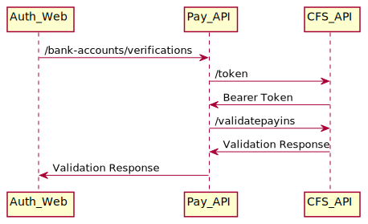
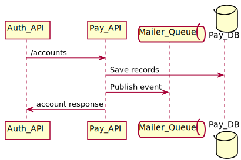
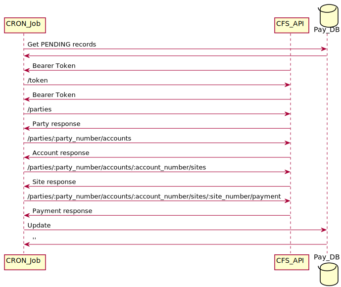
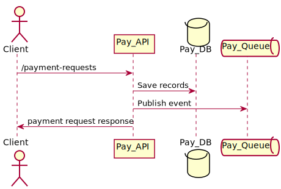
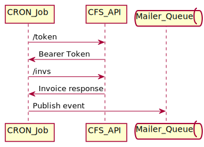
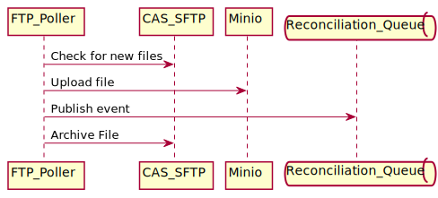
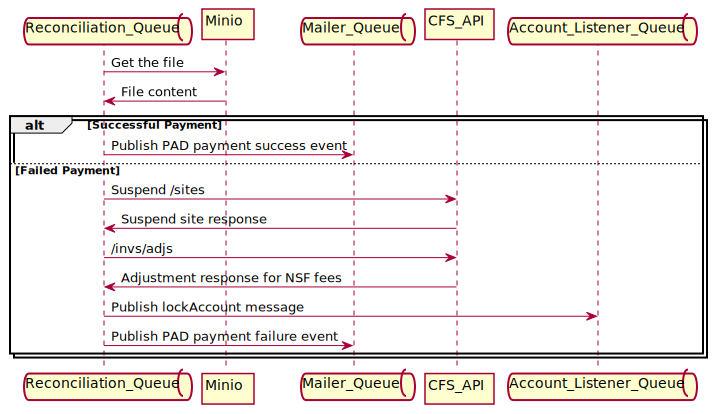
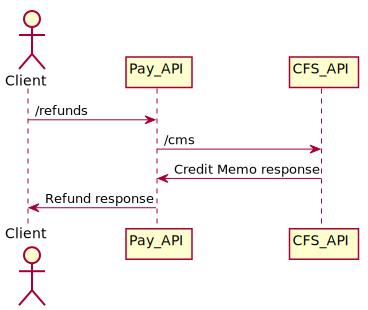
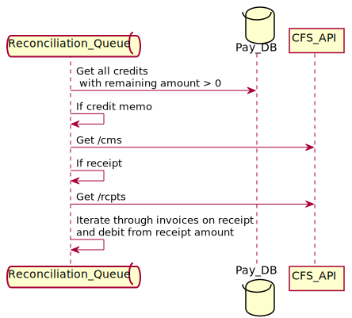
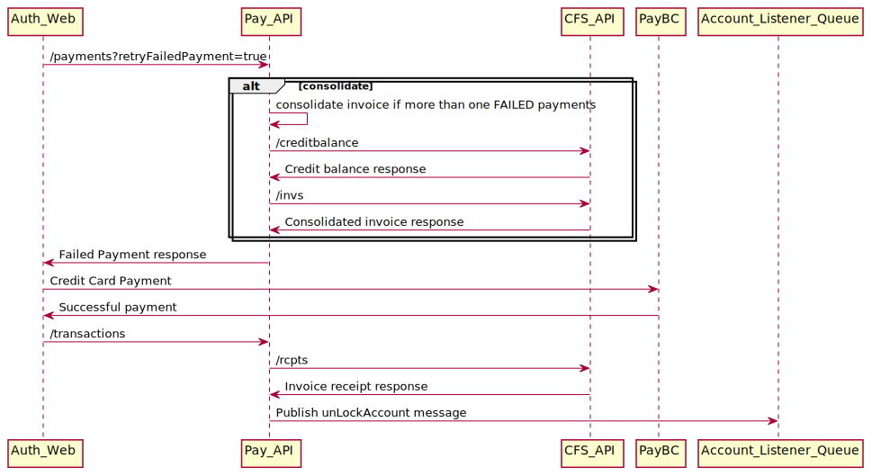

# Pre Authorized Debit Payment (PAD)

Document explains how a Pre Authorized Debit Payment is handled from a technical integration point of view.


### Target Audience
Developers and operational support members.

## Setting Up a PAD account
Setting up a PAD account involves 2 steps,
### Bank details validation
We use CFS provided service to perform this. CFS service validates only the bank number (institution number) and transit number (branch number) for the top 10 banks. <br/>
  > The service doesn't validate the bank account number.

<!--
```
@startuml pad/bank_validation

Auth_Web -> Pay_API: /bank-accounts/verifications
Pay_API -> CFS_API: /token
CFS_API -> Pay_API: Bearer Token
Pay_API -> CFS_API: /validatepayins
CFS_API -> Pay_API : Validation Response
Pay_API -> Auth_Web : Validation Response

@enduml
```
-->
 
###### Error Handling
If CFS service is down pay-api returns an error message back with details including the reason, and auth-web skips the validation without showing any errors to the users.

### Setup customer profile
To deal with CFS outages, setting up a customer profile is done in 2 steps. 
- Pay-API saves the incoming details to the database, publishes events to mailer queue to send PAD docs to customer.
- Cron job picks up these records, create records in CFS and update CFS identifiers in CFS.
#### Save to database
When an account creation request for PAD is received, Pay-API populates the below tables in database,
- payment_accounts
- cfs_accounts - saves the bank details with status as **PENDING**


<!--
```
@startuml pad/create_pay_account
participant Auth_API
participant Pay_API
queue       Mailer_Queue
database    Pay_DB

Auth_API -> Pay_API: /accounts
Pay_API -> Pay_DB : Save records
Pay_API -> Mailer_Queue : Publish event
Pay_API -> Auth_API: account response

@enduml
```
-->


#### Create CFS records
###### Pay CRON job (create_cfs_accounts)
*Job Frequency : Every 5 minutes between 7:00 AM - 11:00 PM PST*

Picks up all records with cfs_accounts status PENDING, creates CFS records and update database records with identifiers from CFS.

CFS needs 4 key records in order to setup a customer profile.
- Party :  Created with customer_name populated using account name . Party record is immutable and is global record in CFS, which means same party can be used by other ministries in CFS.
- Account : A child record to party to indicate ministry account for the party. Created with account_description as BCR.
- Site : A child record to account and created with contact details from the customer account.
- Payment details : A child record to site. This is where all the bank details entered by the customer is sent to CFS.

###### Tables updated
- cfs_accounts - updates cfs party, account, site, payment instrument number. Updates the status to **PENDING_PAD_ACTIVATION**.


<!--
```
@startuml pad/create_cfs_account
participant CRON_Job
participant CFS_API
participant CFS_API
database    Pay_DB

CRON_Job -> Pay_DB: Get PENDING records
Pay_DB -> CRON_Job: 
CFS_API -> CRON_Job: Bearer Token
CRON_Job -> CFS_API: /token
CFS_API -> CRON_Job: Bearer Token
CRON_Job -> CFS_API: /parties
CFS_API -> CRON_Job: Party response
CRON_Job -> CFS_API: /parties/:party_number/accounts
CFS_API -> CRON_Job: Account response
CRON_Job -> CFS_API: /parties/:party_number/accounts/:account_number/sites
CFS_API -> CRON_Job: Site response
CRON_Job -> CFS_API: /parties/:party_number/accounts/:account_number/sites/:site_number/payment
CFS_API -> CRON_Job: Payment response
CRON_Job -> Pay_DB: Update
Pay_DB -> CRON_Job: ''

@enduml
```
-->



###### CFS Error Handling
If error occurs from CFS or due to invalid payment details, Job publishes PAD Setup Failed message to mailer queue and mailer queue notifies the customer about the failure. This can happen if the customer created the account when CFS was down, there by skipping the bank validation OR gave an invalid address and auth schema didn't catch the error.

#### PAD Activation
###### Pay CRON job (activate_pad_accounts)
*Job Frequency : 12:01 AM every day*

Picks up all records with cfs_accounts status PENDING_PAD_ACTIVATION. Update the cfs_accounts status to ACTIVE if the pad_activation_date on payment_accounts has passed the current time.

###### Tables updated
- cfs_accounts - Updates the status to **ACTIVE**.

## Payment Request
When an account with PAD as the payment method initiates a payment request, Pay-API returns a success message if the payment_accounts status is ACTIVE.


<!--
```
@startuml pad/payment_request
actor       Client
participant Pay_API
database    Pay_DB
queue       Pay_Queue

Client -> Pay_API: /payment-requests
Pay_API -> Pay_DB : Save records
Pay_API -> Pay_Queue : Publish event
Pay_API -> Client: payment request response

@enduml
```
-->



###### Tables updated
- invoices - payment_method_code as **PAD**, invoice_status_code as **APPROVED**
- payment_line_items - a line created for each filing type in the request.

###### Error Handling
Payment Request would fail for a PAD account due to below reasons;
- PAD confirmation period is not over there by the status of payment_accounts is not ACTIVE.
- Account is in suspended/NSF state.

## CFS Invoices
PAD invoices are grouped together when CRON Job for creating CFS invoice is executed. N number of invoices in Pay-DB is combined to 1 invoice in CFS with different lines for each filing type code in pay-db invoice.

###### Pay CRON job (create_cfs_invoices)
*Job Frequency : 7:00 PM every day*

Picks up all records from invoices with invoice_status_code APPROVED and payment_method_code is PAD. Group the invoices per account and create invoice in CFS.
All the invoices created for the account from the time last job is run till current time will be included to create CFS invoice.

<!--
```
@startuml pad/create_invoice_job
participant CRON_Job
participant CFS_API
queue       Mailer_Queue

CRON_Job -> CFS_API: /token
CFS_API -> CRON_Job: Bearer Token
CRON_Job -> CFS_API : /invs
CFS_API -> CRON_Job : Invoice response
CRON_Job -> Mailer_Queue : Publish event

@enduml
```
-->




###### Tables updated
- invoice_references - new record created for each invoice with invoice_number from CFS and status_code ACTIVE.

## Reconciliation
PAD transactions are deemed to be success unless a reversal occurs. CFS uploads reconciliation file to SFTP next day morning after the CFS invoice is created. 

<u>File Upload Time</u>
Weekday   : 8:30 AM
Weekend   : 5:30 PM

For more details on CFS integration [click](https://fin.sp.gov.bc.ca/sites/OCG/CFS/Projects/Pages/BCRPO.aspx) here.

###### FTP Poller CRON Job
*Job Frequency : Every minute*

FTP poller scans the CAS SFTP folder for any new file. If any file is found, uploads the file to minio, archive the file and publish an event for reconciliation.

<!--
```
@startuml pad/ftp_poller
participant FTP_Poller
participant CAS_SFTP
participant Minio
queue       Reconciliation_Queue

FTP_Poller -> CAS_SFTP: Check for new files
FTP_Poller -> Minio: Upload file
FTP_Poller -> Reconciliation_Queue: Publish event
FTP_Poller -> CAS_SFTP: Archive File

@enduml
```
-->



###### Reconciliation Queue service
*Subject : bc.registry.payment.casSettlementUploaded*
Reconciliation Queue Service reads the file from Minio upon event and processes the record.

<!--
```
@startuml pad/pad_reconciliation
queue       Reconciliation_Queue
participant Minio
queue       Mailer_Queue
participant CFS_API
queue       Account_Listener_Queue


Reconciliation_Queue -> Minio: Get the file
Minio -> Reconciliation_Queue: File content
alt Successful Payment
    Reconciliation_Queue -> Mailer_Queue : Publish PAD payment success event

else Failed Payment
    Reconciliation_Queue -> CFS_API: Suspend /sites
    CFS_API -> Reconciliation_Queue: Suspend site response
    Reconciliation_Queue -> CFS_API: /invs/adjs
    CFS_API -> Reconciliation_Queue: Adjustment response for NSF fees
    Reconciliation_Queue -> Account_Listener_Queue : Publish lockAccount message
    Reconciliation_Queue -> Mailer_Queue : Publish PAD payment failure event

end

@enduml
```
-->



###### Payment Success
Payment success message is received next day after the invoice is created.
###### Tables updated
- Update invoice_references status_code to COMPLETED
- Update invoices invoice_status_code to PAID
- Create receipts for each invoice
- Create payment record for each row in file

###### Payment Failed (Payment Reversal)
PAD Payment reversal happens if the bank account is invalid, insufficient baolance or a PAD reversal requested by customer from bank. 

###### Tables updated
- Update cfs_accounts status to FREEZE
- Update invoice_references status_code to ACTIVE (From COMPLETED)
- Update invoices invoice_status_code to APPROVED (From PAID)
- Delete receipts for each invoice
- Update payments status_code to FAILED
- Create a new invoices and payment_line_items for the NSF filing type code

## Refunds/Credits
A credit can exist on account on 2 scenarios;
- CFS On Account Receipts : Customer overpays for the transaction. (E.g, online banking customer transfers more than owing. Remanining amount gets added to the account credit). 
- CFS Credit Memo : Customer requests a refund on a PAID PAD invoice.


###### Refund Flow
A Credit memo will be added only if the user have PAID for the invoice. If the invoice is not yet sent to CFS for payments, no credit memo will be generated. For e.g, if the customer does a transaction before 7:00 PM and requests a refund before 7:00 PM on same day then no credit is created. When a credit memo is created it reverses the amount from invoices fee schedule distribution code and add it as a credit to the account.

<!--
```
@startuml pad/refund
actor       Client
participant Pay_API
participant CFS_API

Client -> Pay_API: /refunds
Pay_API -> CFS_API:/cms
CFS_API -> Pay_API:Credit Memo response
Pay_API -> Client: Refund response

@enduml
```
-->



###### Tables updated
- update invoices invoice_status_code to REFUND_REQUESTED
- create new credits record
- update payment_accounts credit field with up-to-date credit
### Sync Credit with CFS
CFS doesn't provide an option to know the up-to-date credit on an account. 
So we had to implement a solution on our side to sync the credits with CFS and calculate the remaining credit on account, by getting all `credits` in pay-db with remaining amount greater than zero. 
This is done as part of daily reconciliation queue service.

<!--
```
@startuml pad/sync_credit
queue       Reconciliation_Queue
database    Pay_DB
participant CFS_API

Reconciliation_Queue -> Pay_DB : Get all credits \n with remaining amount > 0
Reconciliation_Queue -> Reconciliation_Queue : If credit memo
Reconciliation_Queue -> CFS_API : Get /cms
Reconciliation_Queue -> Reconciliation_Queue : If receipt
Reconciliation_Queue -> CFS_API : Get /rcpts
Reconciliation_Queue -> Reconciliation_Queue : Iterate through invoices on receipt \nand debit from receipt amount


@enduml
```
-->



###### Tables updated
- update credits table with remaining_amount
- update payment_accounts credit column with remaining amount

#### NSF

<!--
```
@startuml pad/nsf

Auth_Web -> Pay_API : /payments?retryFailedPayment=true
alt consolidate
Pay_API -> Pay_API : consolidate invoice if more than one FAILED payments
Pay_API -> CFS_API: /creditbalance
CFS_API -> Pay_API: Credit balance response
Pay_API -> CFS_API: /invs
CFS_API -> Pay_API: Consolidated invoice response
end
Pay_API -> Auth_Web: Failed Payment response
Auth_Web -> PayBC : Credit Card Payment
PayBC -> Auth_Web : Successful payment

Auth_Web -> Pay_API : /transactions
Pay_API -> CFS_API : /rcpts
CFS_API -> Pay_API: Invoice receipt response
Pay_API -> Account_Listener_Queue : Publish unLockAccount message

@enduml
```
-->

